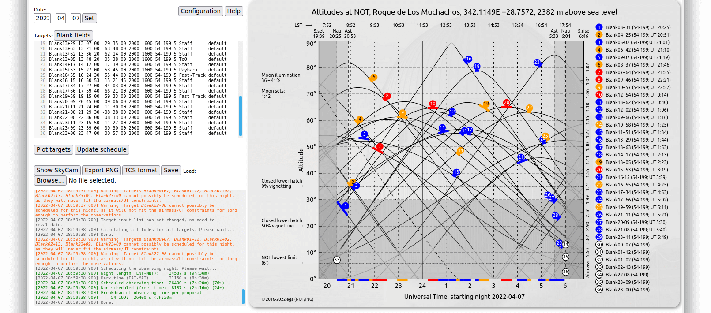
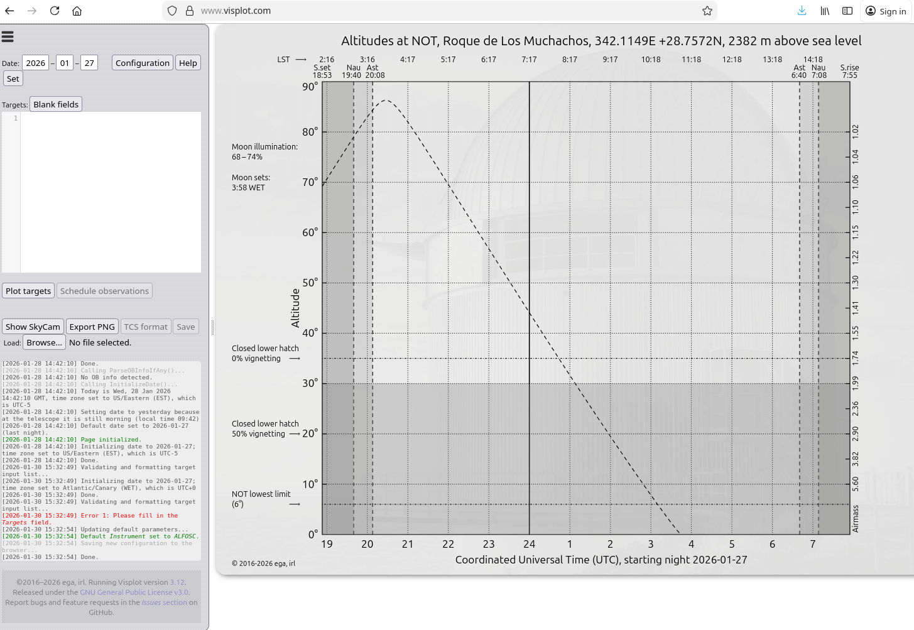
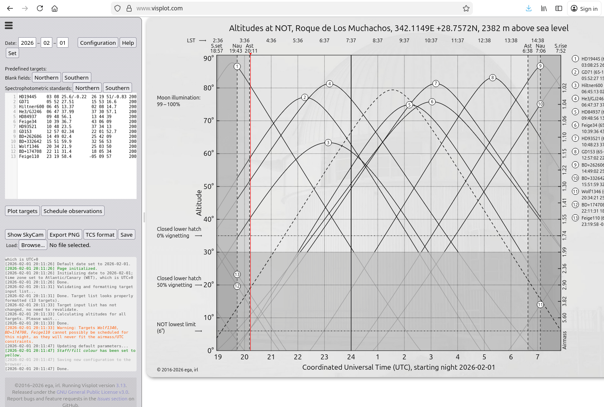
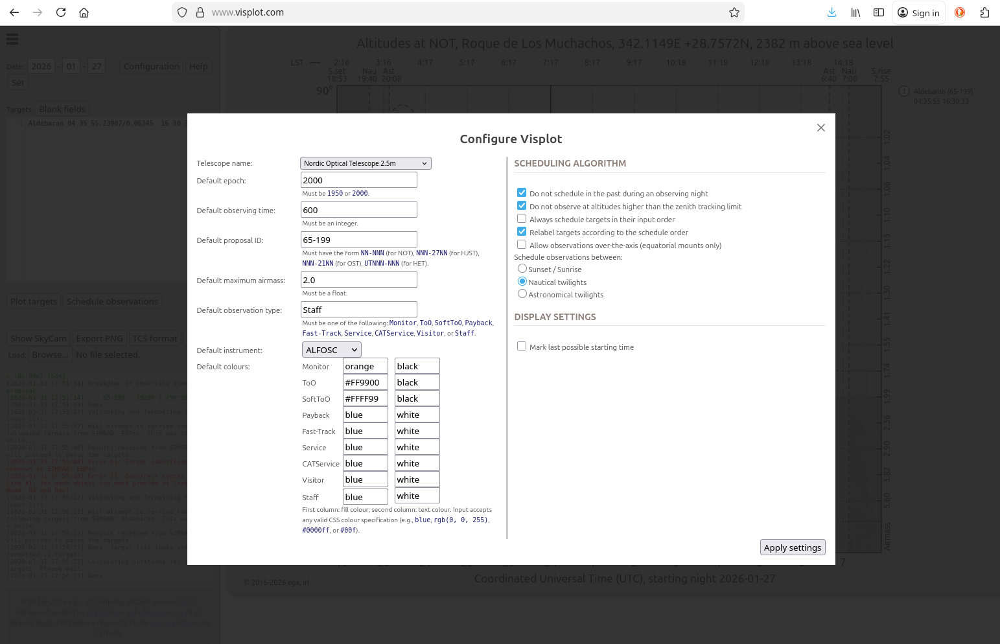
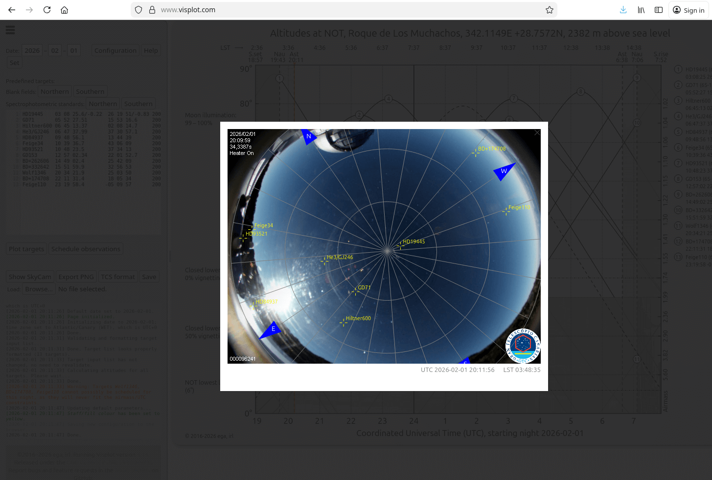

.. _tutorial:

**********************
The Visplot tutorial 
**********************

.. Add some icon substitutions

.. |collapse_sidebar| image:: ../img/sidebar.png
    :height: 2ex

Introduction
============

Visplot is a visibility plot and observation scheduling tool designed for
astronomical telescopes. It enables astronomers to visualize the visibility of
celestial targets throughout an observing night and to automatically schedule
observations in a nearly-optimal way. In doing so, it takes into account
constraints such as airmass limits, time windows, telescope configuration, and
instrument limitations, so you do not have to keep all of them in your head at
once.

The tool already includes a number of commonly used telescopes, and it can be
adapted for other facilities when needed.

Getting Started
===============

Accessing Visplot
-----------------
The easiest way to use Visplot is through the web interface hosted at
`https://www.visplot.com <https://www.visplot.com>`_. No installation is
required; simply open the URL in a modern web browser with HTML5 support and you
are ready to start planning your night.

For a local installation (for example, for development or offline use), follow
the steps described in :ref:`custom_install`.

User Interface Overview
-------------------------

The Visplot interface consists of two main areas: a sidebar on the left and a
main canvas area on the right.

- **Sidebar**: Contains controls for configuration, date selection, target
  input, and buttons for predefined targets, plotting, scheduling, exporting, and saving. The
  sidebar can be collapsed by pressing the |collapse_sidebar| icon in the
  top-left corner if you want a bit more space for the plot.

- **Main Canvas**: Displays the visibility plot, showing altitude versus time
  for the selected targets, together with scheduling information.

Basic Workflow
-----------------

1. **Set the Observing Date**: Enter the desired date in the Date fields and click :guilabel:`Set`. This loads the ephemerides for the selected night. By default, the date is set to today.

   .. image:: figs/set_date.png
      :alt: Setting the observing date
      :width: 200px

2. **Enter Targets**: Input your list of targets in the Targets textarea using the syntax described in `Input Syntax`_. Each target must be placed on its own line. 
    Alternatively, you can load predefined targets directly from the interface,
   such as blank fields or spectrophotometric standard stars. This is described
   in more detail in the `Predefined Targets`_ section.

3. **Plot Targets**: Click :guilabel:`Plot targets` to visualize the visibility curves.

   .. image:: figs/plot_targets.png
      :alt: Visibility plot with targets
      :width: 600px

4. **Schedule Observations**: Click :guilabel:`Schedule observations` to let Visplot optimize the observing order and times.

   .. image:: figs/scheduled_night.png
      :alt: Scheduled observing night
      :width: 600px

5. **Review and Adjust**: Click on target numbers to view details, mark targets as observed, or manually reorder by dragging.

6. **Export Results**: Use the export buttons to save plots or target lists in various formats.

7. **Save**: Click :guilabel:`Save` to download a Visplot-formatted file containing the full session state. This file can later be reloaded using the   :guilabel:`Browse...` button. This is particularly useful when preparing observing nights in advance.. 

Predefined Targets
----------------------

Visplot includes a set of predefined targets that can be loaded directly with a single click from the interface. These are intended to cover common use cases and speed up night preparation. To do so, simply press the :guilabel:`Northern` or :guilabel:`Sourthern` buttons corresponding to either the blank fields or the
spectrophotometric standards. The selected targets will be loaded directly to
the target list, where they can be plotted, scheduled, and modified as usual.

.. warning:: 

    When you load the predefined targets, they will overwrite whatever targets  you currently have in the targets list.

Currently available predefined targets include:

- **Blank fields**:

  Blank fields are available for both the Northern and Southern Hemispheres.
  These can be useful for calibration, testing, or filler observations.

- **Spectrophotometric standards**:

  A list of commonly used spectrophotometric standard stars is provided for
  both hemispheres. These are intended for routine calibration observations
  and can be loaded with a single click.

Current Time Indicator
------------------------

During an observing night, Visplot displays a vertical red line on the main
plot area that indicates the current time. This provides a real-time reference
so you can easily see which targets are currently observable.

Input Syntax
============

Targets are entered using a specific format, with one target per line:

.. code-block::

   [NAME] [RA]/[pmRA] [DEC]/[pmDEC] [EPOCH] [OBSTIME] [PROJECT] [CONSTRAINTS] [TYPE] [OBINFO] [SKYPA]

Where:

- ``[NAME]``: Object name (no spaces)
- ``[RA]``: Right ascension (e.g., ``23 34 34.7`` or ``23:34:34.7``), optionally with proper motion ``[pmRA]`` in arcsec/year
- ``[DEC]``: Declination, same format as RA, optionally with ``[pmDEC]``
- ``[EPOCH]``: Coordinate epoch (``1950`` or ``2000``)
- ``[OBSTIME]``: Observing time in seconds (or ``*`` for priority scheduling)
- ``[PROJECT]``: Project ID (e.g., ``54-199``)
- ``[CONSTRAINTS]``: Airmass (float), UTC range (``UTC[20:00-23:30]``), or LST range (``LST[2-4:30]``)
- ``[TYPE]``: Observation type (``Monitor``, ``ToO``, ``Staff``, etc.)
- ``[OBINFO]``: Additional info (usually ``default``)
- ``[SKYPA]``: Sky Position Angle in degrees

Most fields are optional and default to sensible values.

Examples
--------

* Basic target:

.. code-block::

   EQPsc 23 34 34 -01 19 36

* If the target is included in SIMBAD, the identifier alone is enough:

.. code-block::

    Aldebaran

* Full specification:

.. code-block::

   EQPsc 23 34 34.70 -01 19 36.01 2000 2600 54-321 2.0 Monitor default

* With proper motion:

.. code-block::

   HD84937 09 46 12.06/0.373 13 59 17.44/-0.774 1950 414 54-501 1.5 ToO

* Time-constrained:

.. code-block::

   EQPsc 23 34 34.70 -01 19 36.01 2000 1800 54-321 UTC[22:00-24:00] Staff

* Priority scheduling:

.. code-block::

   EQPsc 23:34:34.70 -01:19:36.01 2000 * 54-321 UTC[20:00-20:30] Staff default

* Offline periods:

.. code-block::

   Offline UTC[20:30-22:30]

Configuration
================

Click :guilabel:`Configuration` to adjust default settings:

- Telescope selection: dropbox or interactive selection on the map.
- Default epoch, observing time, and project ID
- Maximum airmass
- Observation types and colors
- Default Instrument (it can influence the observing constraints)
- Scheduling options (e.g., reschedule in past, zenith limits)

SkyCam Integration
====================

The :guilabel:`Show SkyCam` button opens a live view from the sky camera
associated with the selected telescope.

If Visplot has access to the necessary coordinate transformations, the plotted
targets will be overlaid directly on the camera image. In some environments,
for example within the intranet of the NOT, the current telescope pointing is
also displayed.

In the public web interface, this feature is currently available only for some
telescopes, such as those located at the El Roque de los Muchachos Observatory.

This view can be particularly useful during partially cloudy nights, as it
allows you to quickly identify targets that are clear of clouds and adjust
your observing plan accordingly.

Manual Reordering
==================

After scheduling, drag and drop targets on the right side of the plot to reorder them manually. Visplot will attempt to reschedule the remaining targets accordingly.

Viewing Target Details
=======================

Click on a target's number in the plot to see:

- Observation details: Proposal, Type, RA, Dec, Epoch, Moon distance, Obstime, and Instrument
- Finding chart from Aladin
- Option to mark as observed (only works when the observing night is in progress and you have :guilabel:`Schedule observations`).

.. image:: figs/target_details.png
   :alt: Target details popup
   :width: 700px

Export Options
==============

- **Export PNG**: Save the current plot as an image
- **TCS format**: Export targets in Telescope Control System format
- **Save**: Download a compressed file with all data for later loading

Troubleshooting
===============

- Ensure you are using a modern browser with HTML5 support
- Check that dates and coordinates are in the correct format
- Verify that constraints are realistic for the selected night
- If targets do not appear, ensure the date is set and :guilabel:`Plot targets` has been clicked

.. _logger:

Logger
-------

Visplot maintains a running log in the bottom part of the sidebar that reports
what the page is doing internally. Most issues, together with their proposed
solutions, appear here clearly marked in red.

In the following example, one of the two input targets (``EQPsc``) is not a
valid SIMBAD object:

.. image:: figs/log.png
   :alt: Input log
   :width: 200px

The log shows in red the following message:

.. code::

    [2026-01-31 18:45:25] Error 61: Target identifier unknown to SIMBAD: EQPsc

    [2026-01-31 18:45:25] Error 11: Incorrect syntax on Line #2; for each object you must provide at least the Name, RA and Dec!

Where you can identify:

- the error itself: ``identifier unknown to SIMBAD``,

- the line that contains the error: ``Incorrect syntax on Line #2``, 

- and the proposed solution:  ``for each object you must provide at least the Name, RA and Dec!``.

Community and Support
=======================

If you need additional help using Visplot, there are several resources
available:

- **Built-in Help**: The :guilabel:`Help` button in the interface contains  guidance for most features and reproduces much of this tutorial.

  .. image:: figs/helper.png
     :alt: Visplot Help panel
     :width: 700px

- **GitHub Issues**: For bug reports or feature requests, consult the `issues page <issues>`_ in our documentation.

- **Visplot Google Group**: Join the community to ask questions, share  experiences, and get support from other users:

    visplot (at) googlegroups.com