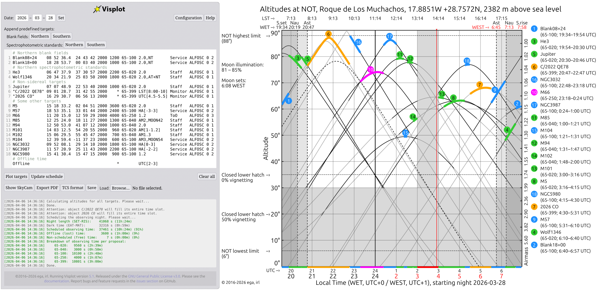
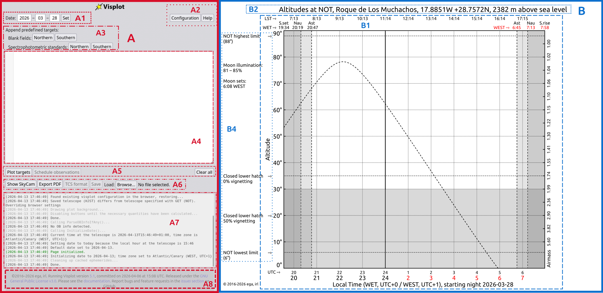
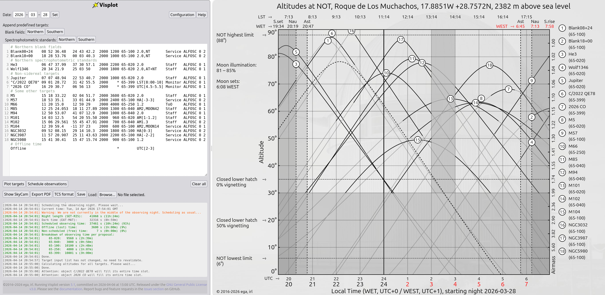
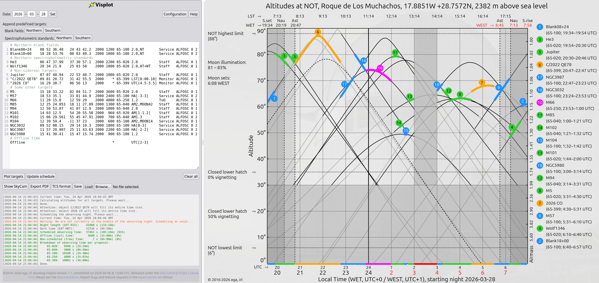
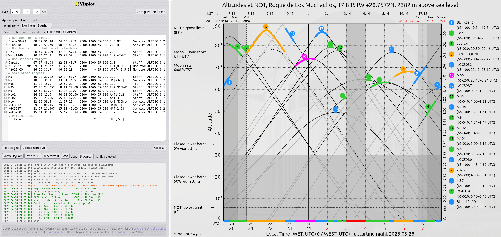
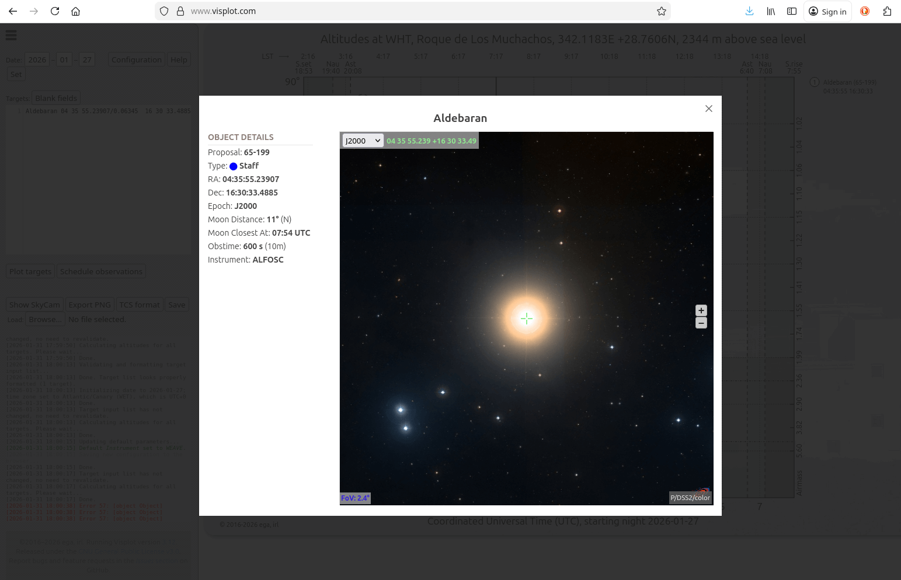
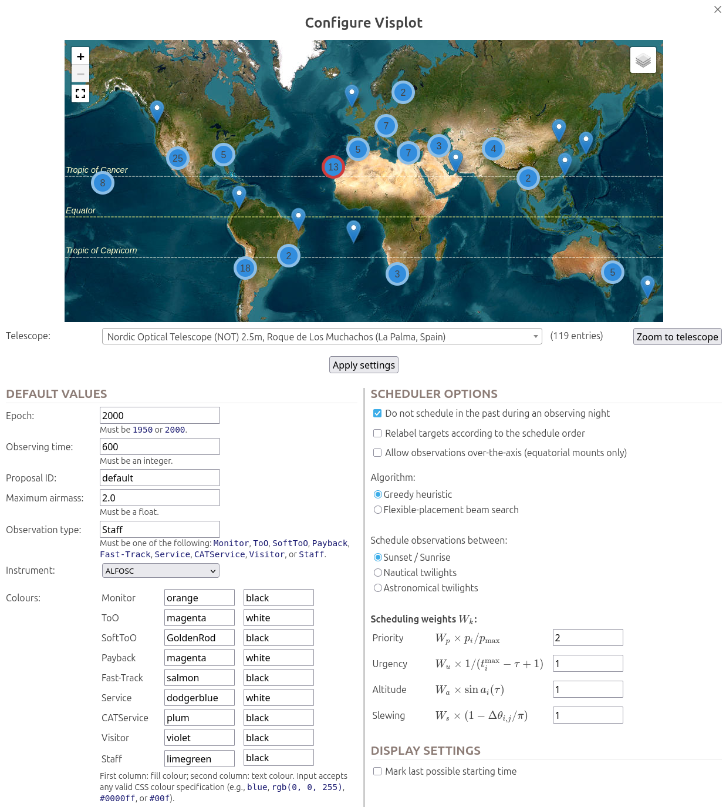
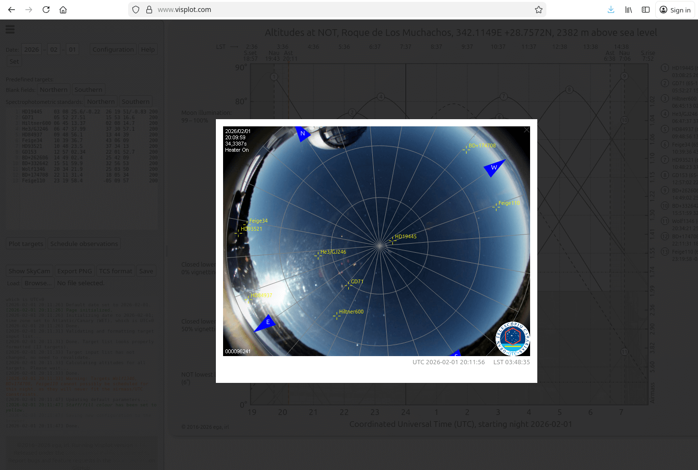

.. _tutorial:

********************
The Visplot tutorial
********************

Introduction
============

Visplot is a visibility plot and observation scheduling tool designed for ground-based
astronomical observatories. It helps observers visualize target visibility,
apply observational constraints (both science-driven like airmass limits and
time windows, and hardware-specific like telescope configuration and instrument
limitations), and build a nightly observing plan with minimal manual bookkeeping.
Because let's face it, staying awake, aware, and fully functional during the
whole observing night is tough enough without juggling all these details
manually.

For a high-level overview of Visplot's capabilities, see :ref:`about`. The main interface is web-based and requires no installation for end users. For detailed information about the web interface features and limitations, see :ref:`webinterface`. A
local deployment is available for development, testing, or offline use; see
:ref:`custom_install` for installation instructions.

.. _fig.snapshot:

   Example of a full-night schedule produced by Visplot for a heterogeneous set of targets.

Quick start
===========

1. Open the `Visplot <https://www.visplot.com>`__ page in a modern web browser.
2. Set the observing date using the `Date` fields and press :guilabel:`Set`.
3. Enter your targets in the target list or append predefined targets.
4. Press :guilabel:`Plot targets` to draw the visibility curves.
5. Press :guilabel:`Schedule observations` to generate a feasible schedule.
6. Use the :guilabel:`Show SkyCam` button (if available), the target details panel, or export tools as needed.

How the interface works
=======================

The Visplot interface has two main areas, as you can see in :numref:`fig.landing`:

- **Sidebar (A)**: Contains the main controls for date selection (A1), configuration (A2), help (A2), 
  predefined target buttons (A3), target input (A4), plotting (A5), scheduling (A5), export (A6), save/load (A6), and the running log (A7). 

- **Main canvas (B)**: Displays the visibility plot (B1), telescope selection (B2), altitude constraints and Moon illumination (B4) and, after scheduling, highlights the allocated observing windows for each target.

The sidebar also provides:

- a :guilabel:`Configuration` (A2) button for default values and scheduler options
- a :guilabel:`Help` (A2) button with the built-in user guide
- :guilabel:`Clear all` (A5) to reset the target list and state
- :guilabel:`Export PDF` (A6) to save the current plot
- :guilabel:`TCS format` (A6) to generate a TCS catalog compatible with NOT
- :guilabel:`Save` and the :guilabel:`Load` file selector (A6) to preserve and
  restore session state

.. _fig.landing:

   Visplot landing page.

Basic workflow
==============

Set the observing date
----------------------

Enter the night you want to plan in the three date fields and press
:guilabel:`Set`. Visplot will load the ephemerides for that night. By default,
the page is preloaded for today's observing night after noon, or for last night
before noon.

   Date zoom-in.

Enter or append targets
-----------------------

Type targets in the text area  using the Visplot input syntax described in :ref:`tut-inputsyntax`.

You can also append predefined targets with the buttons under ``Append predefined targets``:

- **Northern** / **Southern** blank fields
- **Northern** / **Southern** spectrophotometric standards

These buttons append the selected predefined targets to the existing list.

.. _tut-inputsyntax:

Target input syntax
^^^^^^^^^^^^^^^^^^^^

Targets are entered one per line, using the following general format:

.. code-block::

   [NAME] [RA]/[pmRA] [DEC]/[pmDEC] [EPOCH] [OBSTIME] [PROJECT] [CONSTRAINTS] [TYPE] [OBINFO] [SKYPA] [PRIORITY]

The mandatory fields on the list are the target coordinates `[RA]` and `[DEC]`, the rest of the fields may be omitted from the right-hand side; missing values are filled with defaults from the configuration panel.

In the case that the object is included in `Simbad <https://simbad.u-strasbg.fr/simbad/>`__, only the `[NAME]` is mandatory, the coordinates will then be retrieve from the database. (Pro tip: SIMBAD is like that knowledgeable friend who always knows where everything is—except when it doesn't, and then you're back to manual entry.)

Field definitions
""""""""""""""""" 

Field definitions
"""""""""""""""""

- ``[NAME]``: Object name. Spaces are allowed if the name is quoted, e.g.
  ``"Object 5"``.
- ``[RA]``: Right ascension in either space-separated or colon-separated format,
  e.g. ``23 34 34.7`` or ``23:34:34.7``.
- ``[pmRA]``: Optional proper motion in RA (arcsec/year); if omitted, it is
  assumed to be ``0.0``.
- ``[DEC]``: Declination, same format as RA.
- ``[pmDEC]``: Optional proper motion in Dec (arcsec/year); omitted means ``0.0``.
- ``[EPOCH]``: Coordinate epoch, either ``1950`` or ``2000``.
- ``[OBSTIME]``: Total exposure time in seconds, including overheads. Use ``*``
  for a target that must remain scheduled for the full specified interval.
- ``[PROJECT]``: Project or proposal identifier.
- ``[CONSTRAINTS]``: Visibility constraints such as airmass, moon distance,
  hour angle, UTC, LST, and twilight restrictions.
- ``[TYPE]``: Observation type, one of
  ``Monitor``, ``ToO``, ``SoftToO``, ``Payback``, ``Fast-Track``, ``Service``,
  ``CATService``, ``Visitor``, or ``Staff``. For ``Staff`` targets, you can add
  initials like ``Staff/IRL``.
- ``[OBINFO]``: Optional observing block metadata or instrument name.
  ``default`` is used when no value is provided.
- ``[SKYPA]``: Sky position angle in degrees for the finding chart orientation.
- ``[PRIORITY]``: Scheduling priority; higher values are scheduled earlier
  when constraints are otherwise similar.

Common constraint examples
"""""""""""""""""""""""""""""

- Airmass: ``2.0``, ``AM1.5``, ``AM[1.2-1.4]``
- Moon distance: ``MOON40``, ``MOON[40-180]``
- Hour angle: ``HA[0-3]``, ``HA[-2-2]``
- UTC range: ``UTC[20:00-23:30]``
- LST range: ``LST[2-4:30]``
- Twilight / dark time mode: ``NT``, ``AT``, ``DARK``, or combinations like ``AT+DARK``
- Offline periods: ``Offline UTC[20:30-22:30]`` or ``Offline LST[23-3.5]``

When multiple constraints are needed, separate them with commas, for example:

.. code-block::

   HA[0-5],AM[1.2-1.5],MOON165

Notes
"""""""""

- The fields ``[EPOCH]``, ``[OBSTIME]``, ``[PROJECT]``, ``[CONSTRAINTS]``,
  ``[TYPE]``, ``[OBINFO]``, ``[SKYPA]``, and ``[PRIORITY]`` are optional.
- ``[NAME]`` and ``[PROJECT]`` may contain spaces if quoted.
- Blank lines are ignored.
- Lines beginning with ``#`` are treated as comments and are not plotted or
  scheduled.

(And remember: Visplot is forgiving, but not psychic. If your target isn't showing up, double-check that syntax—it's usually the culprit, not a cosmic conspiracy.)

Examples
"""""""""""

* Basic target:
.. code-block::

    EQPsc 23 34 34 -01 19 36

* SIMBAD identifier only:
.. code-block::

    Aldebaran

* Fully specified target:

.. code-block::

    EQPsc 23 34 34.70 -01 19 36.01 2000 2600 54-321 2.0 Monitor default 0 1

* With proper motion:

.. code-block::

    HD84937 09 46 12.06/0.373 13 59 17.44/-0.774 1950 414 54-501 1.5 ToO

* Time-constrained observation:

.. code-block::

    EQPsc 23 34 34.70 -01 19 36.01 2000 1800 54-321 UTC[22:00-24:00] Staff

* Interval scheduling:

.. code-block::

    EQPsc 23:34:34.70 -01:19:36.01 2000 * 54-321 UTC[20:00-20:30] Staff default

Plot targets
------------

Click :guilabel:`Plot targets` to parse the current target list and display the
visibility curves on the canvas. If the target list is valid, each object is
shown as a line representing altitude versus time.

.. _fig.plot_targets:

   Visplot visualization of the visibility curves  for the inputed targets after pressing :guilabel:`Plot targets`.

.. _tut-schedule:
Schedule observations
---------------------

Click :guilabel:`Schedule observations` to let Visplot build an observing plan
that respects your constraints and the selected scheduler options. After the
first schedule is created, the button label changes to :guilabel:`Update schedule`.
From then on, changes to the target list update the existing schedule rather
than resetting it completely.

Visplot currently includes two different  algorithms for scheduling: :ref:`tut-schedule.heuristic` and :ref:`tut-schedule.flexible`.

.. _tut-schedule.heuristic:
Greedy heuristic scheduling algorithm
^^^^^^^^^^^^^^^^^^^^^^^^^^^^^^^^^^^^^^

The greedy heuristic is Visplot's original and default scheduling algorithm. It works by
evaluating targets one time step at a time, calculating a weighted score for each schedulable
target based on:

- **Priority**: User-assigned target priority (highest values scheduled first).
- **Urgency**: Time remaining until the target can no longer be observed (prioritizes 
  targets nearing the end of their visibility window).
- **Altitude**: The target's current altitude (lower airmass = better data quality).
- **Slewing time**: Angular separation from the previously observed target (minimizes overhead).

At each time step, Visplot selects the target with the highest weighted score and schedules it.
The algorithm then moves forward in time and repeats. This approach is fast, predictable, and
well-suited for interactive refinement. It produces operationally sensible schedules in most
night-planning scenarios.

.. _fig.scheduled_night-heuristic:

   Example output from the greedy heuristic algorithm.

.. _tut-schedule.flexible:
Flexible-placement beam search
^^^^^^^^^^^^^^^^^^^^^^^^^^^^^^^^

The flexible-placement beam search is a more sophisticated scheduling algorithm introduced
for complex, tightly-constrained observing nights. Instead of making a single greedy choice
at each time step, it maintains a set of parallel scheduling candidates (a "beam") and explores
multiple scheduling paths simultaneously. This allows it to:

- **Backtrack**: Reconsider earlier scheduling decisions when they lead to dead-ends.
- **Find better solutions**: Escape local optima that the greedy algorithm might settle for.
- **Handle tight constraints**: Excels when targets have overlapping, narrow visibility windows
  or conflicting priorities.

The trade-off is computational cost: the beam search is slower, especially for nights with
many targets. However, for challenging nights where the greedy algorithm fails to schedule
all feasible targets, the beam search often finds better solutions. It also respects the same
weighting criteria (priority, urgency, altitude, slewing) as the greedy heuristic, maintaining
consistency in the scheduling philosophy.

.. _fig.scheduled_night-flexible:

   Example output from the flexible-placement beam search algorithm.

Review and refine
-----------------

- Drag and drop targets on the right-hand side of the plot to manually reorder
  the sequence. Visplot will attempt to preserve feasibility after reordering.

- Use the :guilabel:`Clear all` button to reset the target list and start fresh,
  returning to that blissful moment before you realized you entered the coordinates
  wrong.

  (Pro tip: During a long night, manual reordering can be a lifesaver when
  unexpected clouds roll in or when you realize that target #7 is actually
  brighter than you thought. Or when you make a typo at 3 a.m. and need to 
  recover gracefully.)

Target Details
---------------

Click a target number on the plot to open the details panel and the `ALADIN <https://aladin.cds.unistra.fr/AladinLite/>`__ finding chart.

- Details include Proposal, Type, RA, Dec, Epoch, Moon distance, Obstime, and Instrument

- Mark a target as observed; it will be redrawn in green and excluded from
  future scheduling moves.

.. _fig.target_details:

   Target details panel

Configuration panel
===================

Press :guilabel:`Configuration` to open the settings panel. The configuration
panel is divided into three main areas:

- Telescope selection and map
- Default values for new targets
- Scheduler options and display settings

.. _fig.configuration:

Telescope selection and map
----------------------------

The interactive world map displays pins for all pre-configured telescopes. You can:

- **Zoom and click**: Click on a telescope pin to select it.
- **Search**: Use the text box to search by telescope name or location (e.g., "NOT" or "La Palma").
- **View all**: Press the "View all" button to fit all telescopes in the current map view.
- **Zoom to telescope**: Press "Zoom to telescope" to navigate to the selected telescope on the map.

This beats hunting through a dropdown menu with 100+ telescopes. (Especially when your brain is running on lukewarm coffee at 2 a.m.) 

Telescope-specific pages
""""""""""""""""""""""""

Some telescopes have dedicated Visplot pages with pre-configured settings and additional resources. These are accessible at URLs like ``https://www.visplot.com/[telescope_code]`` (e.g., ``https://www.visplot.com/not`` for the Nordic Optical Telescope). Check the :ref:`links` page for a full list of available telescope-specific pages and their URLs. 

Default values
--------------

Set the default epoch, observing time, proposal ID, maximum airmass, observation
type, and instrument. You can also customize the display colors for each
observation type.

Scheduler options
-----------------

**Scheduling behavior:**

- ``Do not schedule in the past during an observing night``: Once the night has started,
  new schedules will only include observations starting after the current time. Useful
  for live observing refinement.

- ``Relabel targets according to the schedule order``: Automatically renumber targets
  to match their scheduled sequence (target #1 is the first to be observed, etc.).
  Helps keep things organized.

- ``Allow observations over-the-axis`` (equatorial mounts only): Permits observations
  on either side of the meridian for equatorial telescope mounts. Expands your
  scheduling flexibility.

**Scheduler algorithm:**

- ``Greedy heuristic``: Fast, real-time friendly algorithm best for most observing nights.
  See :ref:`tut-schedule.heuristic`.

- ``Flexible-placement beam search``: More sophisticated algorithm for complex, tightly-constrained
  scheduling problems. See :ref:`tut-schedule.flexible`.

- Schedule observations between:

  - ``Sunset / Sunrise``

  - ``Nautical twilights``

  - ``Astronomical twilights``

- Scheduling weights:

  - Priority

  - Urgency

  - Altitude

  - Slewing

Display settings
----------------

Enable or disable visual helpers such as the last possible start time marker.

SkyCam
======

The :guilabel:`Show SkyCam` button opens a live camera overlay when a configured
sky camera is available for the selected telescope. The overlay shows current
UTC and LST and updates automatically.

If a valid target list has been plotted, the targets are overlaid on the SkyCam view and their positions are refreshed automatically. This is especially useful when the sky is partially cloudy, humidity is climbing, or when rapid weather changes require re-planning. (Because nothing ruins a night like discovering the clouds have
other plans for your targets—except maybe an unexpected equipment failure, but we won't
go there)

   Skycam view 

Saving and loading
==================

- :guilabel:`Save` downloads a Visplot session file containing the current target
  list, schedule, and configuration.
- :guilabel:`Browse` restores a saved session file and returns Visplot to the
  previous state.

Use this feature to prepare a plan in advance and continue working on it later,
or to transfer a plan from one computer to another.

Export options
==============

- :guilabel:`Export PDF`: save the current plot as a PDF file.
- :guilabel:`TCS format`: convert targets to a TCS source catalogue.

Troubleshooting
===============

- Use a modern browser with HTML5 support.
- Make sure the observing date is set before plotting targets.
- Check that coordinates, dates, and constraints use the correct syntax.
- If targets do not appear, verify that the list has been plotted and that
  there are no syntax errors.

Logger
======

The sidebar log (located at the bottom of the left panel) is your window into what Visplot is doing
internally. It's like having a helpful colleague whispering in your ear, pointing out what works,
what doesn't, and why.

What the logger reports
------------------------

The logger displays messages in real-time as you interact with Visplot:

- **Info messages** (grey): Confirmation of successful actions (e.g., "Loaded target list with 15 objects").
- **Scheduling messages** (green): Highlights of important results (e.g., schedule statistics, target counts per proposal).
- **Warnings** (orange/yellow): Non-fatal issues that might affect your planning (e.g., "Target is not observable tonight").
- **Errors** (red): Problem that prevent an action from completing (e.g., "Target identifier unknown to SIMBAD").

Each message includes a timestamp, making it easy to trace the sequence of events.

Debugging your target list
---------------------------

When Visplot encounters an invalid target line, the error message includes:

1. **Error description**: What went wrong (e.g., "Error: Unresolved targets:").
2. **Line number**: Exactly which line has the problem (e.g., "Line #7").
3. **Suggested fix**: How to correct it (e.g., "for each object you must provide at least the Name, RA and Dec").

For example:

.. code-block::

   [2026-04-14 22:03:39] Warning: Target au is not in SIMBAD; trying JPL Horizons.
   [2026-04-14 22:03:39] Retrieving targets from JPL Horizons: au. This may take a while...
   [2026-04-14 22:03:40] Results received from Horizons
   [2026-04-14 22:03:40] Warning: Horizons error for au: Ephemeris block not found
   [2026-04-14 22:03:40] Error: Unresolved targets: au
   [2026-04-14 22:03:40] Error: (Line #2) For each object you must provide at least the Name, RA and Dec
   [2026-04-14 22:03:40] Error: Post-processing failure -- TargetList.prototype.validateAndFormatTargets@https://www.visplot.com/js/visplot_targets.js?v=5.1:1641:15

In this case, "au" on line 2 is not recognized by SIMBAD. You can either:

- Provide the coordinates manually (e.g., ``au 23 34 34 -01 19 36``).
- Check the spelling and capitalization.
- Use a different identifier (e.g., "EQ Piscium" or "HR 8832").

Tips for efficient debugging
^^^^^^^^^^^^^^^^^^^^^^^^^^^^

- **Read from the bottom up**: The most recent message is at the bottom of the log, so scroll there first.
- **One error at a time**: Fix the first error, then re-plot. Often, one mistake cascades into multiple errors.
- **Copy coordinates from SIMBAD**: Use the database directly to verify object names and positions before entering them.
- **Test incrementally**: When adding many targets, add a few at a time and plot to catch errors early.
  (Debugging 50 typos at 3 a.m. is nobody's idea of fun.)

The logger as a debugging tool
^^^^^^^^^^^^^^^^^^^^^^^^^^^^^^^

If you're stuck, the logger is often the answer. Before asking for help:

1. Look at the log for error messages.
2. Identify which line(s) are problematic.
3. Cross-check your input syntax against the examples in :ref:`tut-inputsyntax`.

(Pro tip: Many "bugs" are actually just creative interpretations of the input syntax. The logger is very good at calling this out diplomatically.)

Community and support
=====================

You're not alone in the night—or in your Visplot questions. Here are the resources available to help you:

**Quick help, right now**

- :guilabel:`Help` button: Need a quick reminder about input syntax, scheduler options, or what a button does?
  Press the :guilabel:`Help` button in the interface for concise guidance without leaving Visplot. Perfect for
  those moments at the telescope when you need an answer in 10 seconds, not 10 minutes.

**Comprehensive documentation**

- `Read the Docs <https://visplot.readthedocs.io/>`__: The full Visplot documentation site, including tutorials
  (like this one), detailed reference material, installation instructions, and troubleshooting guides.
  Start here if you're planning a session at home or want to understand Visplot in depth.

- :ref:`news`: Stay updated with the latest features, bug fixes, and announcements from the Visplot development team.

**Report problems or suggest improvements**

- `GitHub Issues <https://github.com/egafton/visplot/issues>`__: Found a bug or have a feature request?
  Check the issues page to see if someone has already reported it, or open a new issue.
  For detailed guidance on what to include when reporting a bug or requesting a feature, see :ref:`issues`.

**Connect with other observers**

- `Visplot Google Group <https://groups.google.com/g/visplot>`__: Join a community of astronomers, telescope
  operators, and developers using Visplot. Ask questions, share observing experiences, exchange tips and tricks,
  and learn from others' solutions.
  
  To join or post: visplot (at) googlegroups.com

**Contributing code or translations**

- `GitHub Repository <https://github.com/egafton/visplot>`__: Visplot is open-source. If you'd like to fix a bug,
  add a feature, improve documentation, or contribute a translation, you're welcome to submit a pull request.
  The code is well-organized and documented; developers of all levels have contributed improvements.

Wrapping up
===========

Congratulations! You've now got the full tour of Visplot—from plotting your first targets to scheduling a night that even the stars would envy. Remember, the key to great observing is preparation, and Visplot is here to make that as painless as possible. If you run into snags, the logger is your best friend, and the community is always ready to lend a hand (or a fresh pot of coffee).

For more advanced tips, check out the other sections of this documentation, or dive into the code if you're feeling adventurous. Clear skies and good observing!

