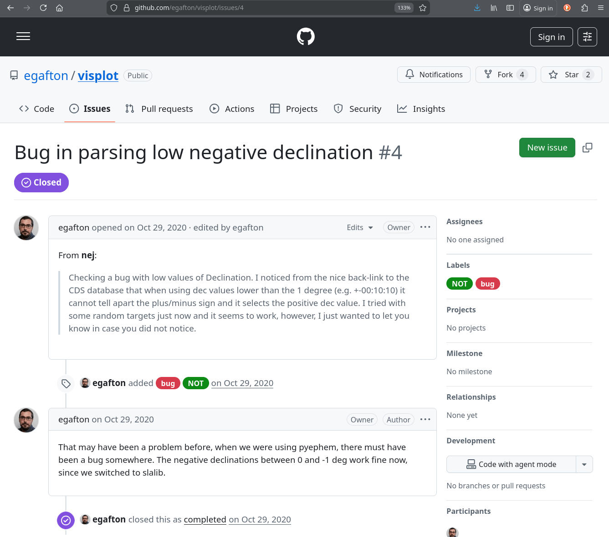

.. _issues:

******************************************
Reporting Issues or Requesting Features
******************************************

Visplot is an open-source project, and we greatly value feedback from the community. The best way to report bugs, request new features, or suggest improvements is through the :guilabel:`Issues` page on our GitHub repository: https://github.com/egafton/visplot/issues.

.. image:: figs/github-issues.png
   :width: 700
   :alt: GitHub Visplot Issues Page

Before submitting an issue, please check if a similar one already exists by searching the repository's issues. This helps avoid duplicates and allows you to contribute to ongoing discussions.

Reporting a Bug
===============

When reporting a bug, providing detailed information helps us reproduce and fix the issue quickly. Please include as much of the following as possible:

* **Environment**: Specify whether you're using the web interface (https://www.visplot.com/) or a local/custom installation (e.g., Docker setup).
* **Steps to Reproduce**: A clear, step-by-step description of the actions that led to the bug.
* **Expected Behavior**: What you expected to happen.
* **Actual Behavior**: What actually happened, including any error messages.
* **Screenshots or Logs**: If applicable, attach screenshots of the issue or relevant console logs.
* **Browser/OS Details**: For web interface issues, include your browser version, operating system, and any relevant extensions.
* **Additional Context**: Any other information that might be helpful, such as the date/time of the issue or recent changes to your setup.

Example of a reported bug:

We aim to respond to bug reports within a few days and will keep you updated on our progress.

Requesting New Features
=======================

We welcome ideas for new features that can enhance Visplot's functionality. To request a feature:

1. **Check Existing Requests**: Search the issues to see if your idea has already been suggested.

2. **Create a New Issue**: Apply the available label :guilabel:`Enhancement` or clearly label your issue as a feature request.

3. **Provide Details**: Describe the feature, why it's needed, and how it would benefit users. Include mockups, examples, or references if possible.

4. **Discuss and Refine**: Be open to feedback from maintainers and the community to refine your idea.

Adding New Telescopes
---------------------

Visplot supports multiple telescopes, and we're always happy to add new ones to expand our coverage. To request the addition of a new telescope, please provide the following minimum information:

* **Name of Telescope/Observatory**: The full name and any common abbreviations.

* **Location Details**:
  * Latitude (in degrees, positive for North)
  * Longitude (in degrees, positive for East)
  * Elevation (in meters above sea level)

* **Observing Constraints**:
  * Minimum elevation (in degrees)
  * Collision points (if any, for equatorial telescopes)
  * Zenith exclusion zones (if any, for alt-azimuth telescopes)

* **Additional Notes**: Any other relevant details, such as time zone, typical observing hours, or special constraints.

See, for instance, Issue #12:

.. image:: figs/github-issue12example.png
   :width: 700
   :alt: Example of GitHub Issue #12

Once submitted, we'll review the request and implement the addition in a future update.

Contributing Code
=================

If you're interested in contributing code fixes or new features directly:

1. Fork the repository on GitHub.

2. Create a new branch for your changes.

3. Make your modifications and ensure they follow the project's coding standards.

4. Submit a pull request with a clear description of your changes.

5. Our team will review and provide feedback.

.. For more details, see the `CONTRIBUTING.md` file in the repository (if available) or check the repository's README.

Support and Community
=====================

For general questions, discussions, or support that doesn't fit into a bug report or feature request, consider:

* Checking the `Tutorial <tutorial.html>`_ and other documentation pages.

* Contacting the maintainers directly via email.

Thank you for helping improve Visplot!
