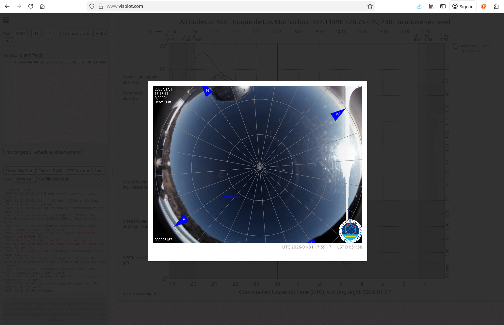
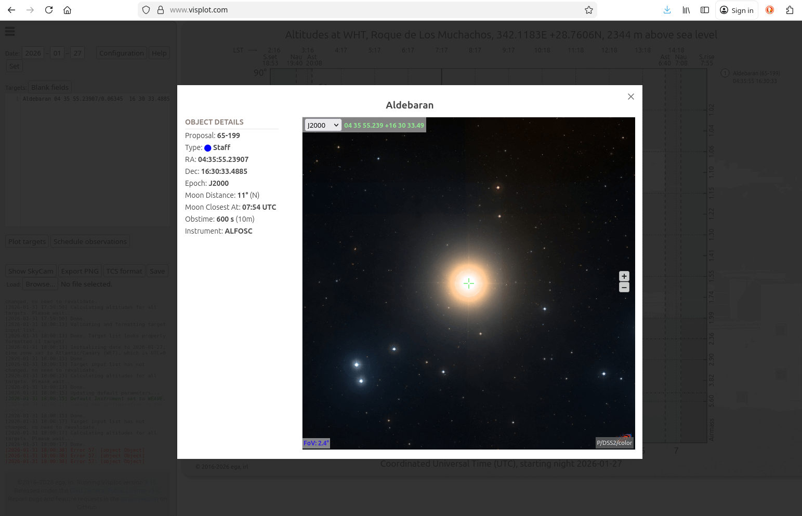
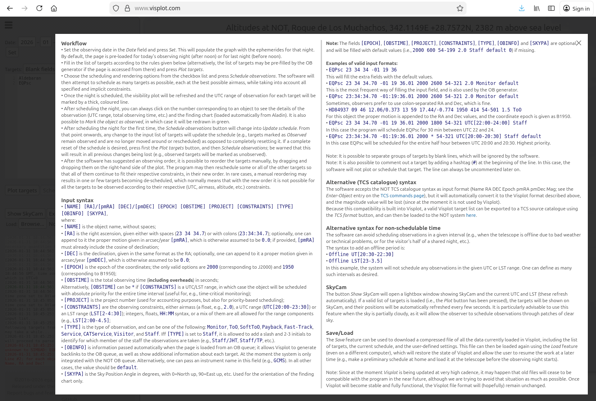
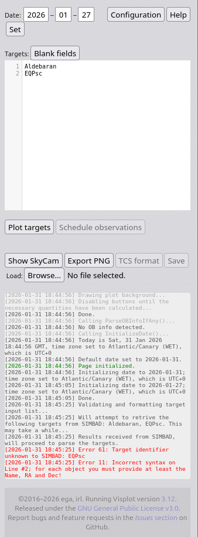

.. _tutorial:

**********************
The Visplot tutorial 
**********************

.. Add some icon substitutions

.. |collapse_sidebar| image:: ../img/sidebar.png
    :height: 2ex

Introduction
============

Visplot is a visibility plot and observation scheduling tool designed for telescopes. It enables astronomers to visualize the visibility of celestial targets throughout an observing night and automatically schedule observations in a nearly-optimal way, taking into account various constraints such as airmass, time windows, telescope,  and instrument limitations.

.. image:: ../img/snapshot.png
   :alt: Visplot main interface
   :width: 600px

The tool already includes a number of telescopes, but can be adapted for other facilities.

Getting Started
===============

Accessing Visplot
-----------------

The easiest way to use Visplot is through the web interface hosted at `https://www.visplot.com <https://www.visplot.com>`_. No installation is required; simply open the URL in a modern web browser with HTML5 support.

For local installation (e.g., for development or offline use), follow the steps described in :ref:`custom_install`

User Interface Overview
=======================

The Visplot interface consists of a sidebar on the left and a main canvas area on the right.

- **Sidebar**: Contains controls for configuration, date setting, target input, and various buttons for plotting, scheduling, and exporting. It can be collapsed by pressing the |collapse_sidebar| icon on the top-left. 

- **Main Canvas**: Displays the visibility plot, showing altitude vs. time for targets, along with scheduling information.

.. image:: figs/landing_overview.png
   :alt: User interface overview
   :width: 600px

Basic Workflow
==============

1. **Set the Observing Date**: Enter the date in the Date fields and click :guilabel:`Set`. This loads the night's ephemerides. By default, the date will be set to today.

   .. image:: figs/set_date.png
      :alt: Setting the observing date
      :width: 300px

2. **Enter Targets**: Input your list of targets in the Targets textarea using the specified syntax (detailed in `Input Syntax`_).

3. **Plot Targets**: Click :guilabel:`Plot targets` to visualize the visibility curves.

   .. image:: figs/plot_targets.png
      :alt: Visibility plot with targets
      :width: 600px

4. **Schedule Observations**: Click :guilabel:`Schedule observations` to let Visplot optimize the observing order and times.

   .. image:: figs/scheduled_night.png
      :alt: Scheduled observing night
      :width: 600px

5. **Review and Adjust**: Click on target numbers to view details, mark targets as observed, or manually reorder by dragging.

6. **Export Results**: Use the export buttons to save plots or target lists in various formats.

7. **Save**: Click :guilabel:`Save` to save a visplot formatted file with all the data. This file can be loaded later using the button :guilabel:`Browse...`. 
This is particularly useful for preparing your nights in advance. 

Input Syntax
============

Targets are entered in a specific format, one per line:

.. code-block::

   [NAME] [RA]/[pmRA] [DEC]/[pmDEC] [EPOCH] [OBSTIME] [PROJECT] [CONSTRAINTS] [TYPE] [OBINFO] [SKYPA]

Where:

- ``[NAME]``: Object name (no spaces)
- ``[RA]``: Right ascension (e.g., ``23 34 34.7`` or ``23:34:34.7``), optionally with proper motion ``[pmRA]`` in arcsec/year
- ``[DEC]``: Declination, same format as RA, optionally with ``[pmDEC]``
- ``[EPOCH]``: Coordinate epoch (``1950`` or ``2000``)
- ``[OBSTIME]``: Observing time in seconds (or ``*`` for priority scheduling)
- ``[PROJECT]``: Project ID (e.g., ``54-199``)
- ``[CONSTRAINTS]``: Airmass (float), UTC range (``UTC[20:00-23:30]``), or LST range (``LST[2-4:30]``)
- ``[TYPE]``: Observation type (``Monitor``, ``ToO``, ``Staff``, etc.)
- ``[OBINFO]``: Additional info (usually ``default``)
- ``[SKYPA]``: Sky Position Angle in degrees

Most fields are optional and default to sensible values.

Examples
--------

* Basic target:

.. code-block::

   EQPsc 23 34 34 -01 19 36

* If the target is included in simbad, the ID is enough:

.. code-block::

    Aldebaran

* Full specification:

.. code-block::

   EQPsc 23 34 34.70 -01 19 36.01 2000 2600 54-321 2.0 Monitor default

* With proper motion:

.. code-block::

   HD84937 09 46 12.06/0.373 13 59 17.44/-0.774 1950 414 54-501 1.5 ToO

* Time-constrained:

.. code-block::

   EQPsc 23 34 34.70 -01 19 36.01 2000 1800 54-321 UTC[22:00-24:00] Staff

* Priority scheduling:

.. code-block::

   EQPsc 23:34:34.70 -01:19:36.01 2000 * 54-321 UTC[20:00-20:30] Staff default

* Offline periods:

.. code-block::

   Offline UTC[20:30-22:30]

Advanced Features
=================

Configuration
-------------

Click :guilabel:`Configuration` to adjust default settings:

- Telescope selection
- Default epoch, observing time, project ID
- Maximum airmass
- Observation types and colors
- Default Instrument (it can influence the observing constraints)
- Scheduling options (e.g., reschedule in past, zenith limits)

.. image:: figs/configuration.png
   :alt: Configuration panel
   :width: 700px

SkyCam Integration
------------------

The :guilabel:`Show SkyCam` button opens a live view of the sky camera, with targets overlaid if plotted.

In the web interface, this option only works with the telescopes located at El Roque de Los Muchachos Observatory at the moment.

Manual Reordering
-----------------

After scheduling, drag and drop targets on the right side of the plot to reorder them manually. Visplot will attempt to reschedule others accordingly.

Viewing Target Details
----------------------

Click on a target's number in the plot to see:

- Observation details: Proposal, Type, RA, Dec, Epoch, Moon distance, Obstime, and Instrument
- Finding chart from Aladin
- Option to mark as observed (only on integrated systems, like at the NOT)

Export Options
--------------

- **Export PNG**: Save the current plot as an image
- **TCS format**: Export targets in Telescope Control System format
- **Save**: Download a compressed file with all data for later loading

Helper
=======

The tool also has a :guilabel:`Help` buttom, that contains most of this tutorial:

Troubleshooting
===============

- Ensure you're using a modern browser with HTML5 support
- Check that dates and coordinates are in the correct format
- For scheduling issues, verify constraints are realistic
- If targets don't appear, ensure the date is set and "Plot targets" is clicked

Logger
-------

Visplot also has a running log placed on the bottom part of the sidebar that outputs what the page is doing. Most of the issues (and their solutions) appear there clearly marked as red. 

In the following example, one of the two targets inputed `EQPsc` is not a valid simbad object:

The log shows in red the following message:

.. code::

    [2026-01-31 18:45:25] Error 61: Target identifier unknown to SIMBAD: EQPsc
    
    [2026-01-31 18:45:25] Error 11: Incorrect syntax on Line #2; for each object you must provide at least the Name, RA and Dec!

Where you can identify:

- the error ``identifier unknown to SIMBAD``,

- the line that contains the error ``Incorrect syntax on Line #2``, 

- and the proposed solution ``for each object you must provide at least the Name, RA and Dec!``.

For more help, refer to the built-in Help section in Visplot or check the GitHub issues page.

